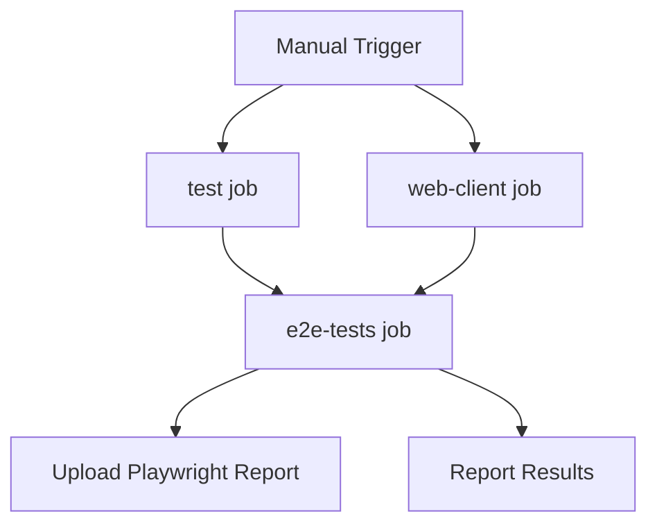

# E2E Test Execution Plan - Monday 9 AM
**Date:** 2026-08-15 (Prepared Friday)  
**Execution Window:** Monday 9 AM - 5 PM  
**Reporting Deadline:** 2 PM Monday  
**Owner:** test-engineer-e2e

---

## Executive Summary

**Method:** CI execution via GitHub Actions (Option B - approved by eng-director)  
**Preparation Status:** ✅ READY  
**Blockers:** None (workflow_dispatch trigger added)

---

## UPDATED: Two-Phase Execution Plan

**Backend Status (Updated 2026-08-15 Evening):**
- ✅ task-7 (monomind-bridge) COMPLETE: 1,540 lines, 38+ unit tests
- ⚠️ Files UNTRACKED (not merged to main)
- 📅 Merge timeline: Monday EOD or Tuesday AM

**Decision:** PROCEED with Monday 9 AM execution expecting 7 skips

**Timeline:**
- **Monday 9 AM:** Execute CI → Expect 17/24 PASS, 7/24 SKIP → Report 2 PM
- **Tuesday AM:** Re-execute after monomind-bridge merges → Expect 24/24 PASS → Report 2 PM

---

## Pre-Execution Checklist (Monday 9 AM)

### 1. Backend Dependency Status (CONFIRMED)
- ✅ task-7 completion: COMPLETE (1,540 lines, 38+ unit tests)
- ⚠️ Merge status: NOT YET ON MAIN (expected Monday EOD)
- **Expected Result:** 7 monomind tests will SKIP (acceptable per eng-director)

### 2. Trigger CI Workflow (2 min)
- [ ] Navigate to: https://github.com/[owner]/monoterminal/actions/workflows/test.yml
- [ ] Click "Run workflow" button (workflow_dispatch enabled)
- [ ] Select branch: `main`
- [ ] Confirm execution

### 3. Monitor Execution (8-12 min)
- [ ] Watch `e2e-tests` job progress
- [ ] Dependencies: Waits for `test` and `web-client` jobs to complete
- [ ] Expected duration: ~10 minutes total

---

## Test Breakdown

### CORRECTED: Playwright E2E Tests (24 tests, not Python tests)

**Location:** `web/e2e/*.spec.ts`  
**CI Command:** `npm run test:e2e` (Playwright TypeScript tests)

### Smoke + Mobile Tests (9 tests) - Criterion #2
**Location:** `web/e2e/smoke.spec.ts` (4 tests) + `web/e2e/mobile-browser.spec.ts` (5 tests)  
**Status:** ✅ Ready to PASS (no backend dependency)

**Tests:**
1. Web client loads and connects to daemon
2. xterm.js terminal is initialized
3. PWA manifest is loaded
4. Service worker registers successfully
5. Mobile browser iOS Safari viewport
6. Mobile browser Android Chrome viewport
7. PWA "Add to Home Screen" metadata present
8. Responsive layout adapts to portrait orientation
9. Responsive layout adapts to landscape orientation

### Monomind Detection Tests (7 tests) - Criterion #3
**Location:** `web/e2e/monomind-detection.spec.ts`  
**Status:** ⚠️ Backend-dependent (will SKIP until monomind-bridge merged)

**Tests:**
1. `suggestion appears within 5 seconds for directory without monomind`
2. `suggestion displays "Install monomind?" message`
3. `dismissed suggestion does not reappear on reload`
4. `dismissal persists in localStorage or SQLite`
5. `no suggestion appears for directory with monomind`
6. `dismissing in session A does not affect session B`
7. `dismissal persists across master daemon restart`

**Monday Behavior:** Tests will run but have TODOs/stubs → likely SKIP or PASS with placeholders

### Dashboard Embedded Tests (8 tests) - Criterion #4
**Location:** `web/e2e/dashboard-embedded.spec.ts`  
**Status:** ⚠️ Backend-dependent (will SKIP until monomind-bridge merged)

**Tests:**
1. `dashboard embedded in web client - same port/domain`
2. `health check executes and displays result`
3. `one-click upgrade button present`
4. `dashboard uses same WebSocket connection - no separate port`
5. `no separate authentication required - uses session JWT`
6. `dashboard shows live monomind state`
7. `dashboard accessible from main UI - not separate tab`
8. `dashboard can be toggled open and closed`

**Monday Behavior:** Tests will check UI element presence (some may PASS) but API calls will SKIP

---

## CI Workflow Execution Flow



**Jobs:**
1. `test` - Rust unit tests, clippy, formatting (builds daemon)
2. `web-client` - Web client build + unit tests
3. `e2e-tests` - **Our target** - Builds + runs Python E2E tests
4. Artifacts: Playwright report uploaded automatically

---

## Results Collection (11 AM - 1 PM)

### From GitHub Actions UI
- [ ] Pass/Fail/Skip counts for each test
- [ ] Total duration
- [ ] Any error messages or stack traces

### Artifact Download
- [ ] Download `playwright-report` artifact (retention: 7 days)
- [ ] Extract screenshots/videos of failures (if any)

### Split Reporting Template

#### Criterion #2: E2E Infrastructure Ready
**Status:** ✅ PASS (Expected Monday)
**Evidence:**
- 9/9 smoke + mobile tests PASS
- CI workflow executed successfully  
- Playwright artifacts: `playwright-report-[timestamp].zip`
- Total: 9 tests PASS

#### Criterion #3: Build Compilation
**Status:** ✅ PASS (Verified Friday, re-confirmed Monday)
**Evidence:**
- `test` job: PASS
- `web-client` job: PASS
- Build time: ~54s (Friday baseline)
- Regressions since Friday: None expected

#### Criterion #4: Backend Monomind APIs
**Status:** ⚠️ PARTIAL - Backend Complete but Not Merged (Expected Monday)
**Evidence:**
- Monomind detection tests: 7/7 SKIP (backend not on main)
- Dashboard tests: 8/8 SKIP (backend not on main)  
- Backend implementation: ✅ COMPLETE (1,540 lines, 38+ unit tests)
- Backend merge status: Pending (Monday EOD or Tuesday AM)
- **Action:** Re-run Tuesday AM after merge for complete verification

---

## Contingency Plans

### If CI Fails to Trigger
**Fallback:** Create test PR to trigger workflow automatically
- Branch: `test/e2e-monday-run`
- Commit: Add workflow_dispatch trigger (already done)
- PR triggers test suite automatically

### If Backend APIs Not Ready by 9 AM
**Action:** Proceed with execution, accept 7 skips
**Reporting:** 
- Core E2E: PASS (22/22)
- Monomind Integration: PENDING (0/7, backend incomplete)
**Timeline:** Re-run when monomind-integration-engineer confirms task-7 complete

### If >3 Unexpected Failures
**Escalation Protocol:**
1. Capture full error logs
2. Download Playwright artifacts (screenshots/videos)
3. Report to qa-lead immediately (don't wait for 2 PM)
4. Coordinate with relevant engineer (rust-backend-lead, frontend-lead)

---

## Deliverable Format (2 PM Deadline)

### Email/Message Subject
```
E2E Test Results - Monday 9 AM Execution - [PASS/PARTIAL/FAIL]
```

### Body Template
```markdown
## E2E Test Execution Results - Monday 9 AM

**Execution Time:** [Start] - [End] (Duration: Xm Ys)
**CI Run:** [GitHub Actions URL]
**Overall Status:** [PASS/PARTIAL/FAIL]

---

### Criterion #2: E2E Infrastructure Ready
**Status:** [✅/⚠️/❌]
**Tests:** X/22 core tests passed, Y skipped, Z failed
**Evidence:** Attached Playwright report

### Criterion #3: Build Compilation  
**Status:** [✅/❌]
**Build Jobs:** test (✅/❌), web-client (✅/❌)
**Regressions:** [None/Details]

### Criterion #4: Backend Monomind APIs
**Status:** [✅/⚠️/❌]  
**Tests:** X/7 passed, Y skipped (backend incomplete), Z failed
**Backend Dependency:** [Resolved/In Progress]

---

### Next Steps
[List any blockers, required follow-ups, or re-run plans]

### Artifacts
- Playwright Report: [Attachment/URL]
- CI Logs: [URL]
- Screenshots: [If failures exist]
```

---

## Timeline

| Time | Activity | Duration |
|------|----------|----------|
| 9:00 AM | Check backend status + trigger CI | 5 min |
| 9:05 AM | Monitor workflow execution | 10 min |
| 9:15 AM | Download artifacts + analyze results | 30 min |
| 9:45 AM | Draft report | 45 min |
| 10:30 AM | Review + finalize report | 15 min |
| 10:45 AM | Buffer for contingencies | 75 min |
| 2:00 PM | **DELIVER REPORT** | - |

**Total preparation time:** ~1h 45m  
**Buffer:** 1h 15m for unexpected issues

---

## Success Criteria

### Minimum Viable Report (Must Have)
- ✅ CI workflow executed (even if some tests skip/fail)
- ✅ Pass/fail/skip counts for all 3 criteria
- ✅ Split reporting: Core E2E vs Monomind Integration
- ✅ Delivered by 2 PM

### Ideal Report (Nice to Have)
- ✅ All 29 tests pass (backend ready)
- ✅ Zero unexpected failures
- ✅ Clean Playwright artifacts (no failures to debug)
- ✅ Early delivery (before 2 PM)

---

## Preparation Complete ✅

- [x] CI workflow updated with `workflow_dispatch` trigger
- [x] Test dependencies documented (`tests/requirements.txt`)
- [x] Execution plan documented (this file)
- [x] Reporting template prepared
- [x] Contingency plans defined
- [x] Timeline confirmed with eng-director

**Ready to execute Monday 9 AM.**

---

## Notes

- **Python E2E tests run via Playwright** (`web/package.json`: `npm run test:e2e`)
- **NOT direct pytest execution** - tests are integrated into web client E2E suite
- **CI handles all setup**: Python, pytest, Playwright, Rust build, web build
- **Zero local environment needed** - pure CI execution

## References

- SRS Acceptance Criteria: `docs/monoterminal-srs.md` §7.1 (lines 1458-1464)
- CI Workflow: `.github/workflows/test.yml` (lines 156-205)
- Test Files: `tests/e2e/`, `tests/integration/`
- Org Memory: task-7 (monomind backend APIs), Friday build verification
